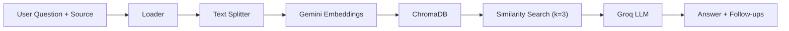

<p align="center">
  
</p>

<h1 align="center">OmniQuery</h1>

<p align="center">
  <strong>AI-Powered Multi-Source Question Answering Platform</strong>
</p>

<p align="center">
  Ask questions about any website, YouTube video, or document — and get instant, context-grounded answers powered by RAG.
</p>

<p align="center">
  <a href="#features">Features</a> &bull;
  <a href="#architecture">Architecture</a> &bull;
  <a href="#tech-stack">Tech Stack</a> &bull;
  <a href="#getting-started">Getting Started</a> &bull;
  <a href="#api-reference">API Reference</a> &bull;
  <a href="#project-structure">Project Structure</a> &bull;
  <a href="#contributing">Contributing</a> &bull;
  <a href="#license">License</a>
</p>

---

## Demo

<p align="center"> <a href="https://drive.google.com/file/d/1GGtMz0UuMRXGo-_8bVlT4tIftpXVpOnB/view?usp=sharing"> Watch the demo on Google Drive </a> </p>

---

## Overview

OmniQuery is a full-stack Retrieval-Augmented Generation (RAG) application that lets users query information from three distinct source types through a single chat interface:

| Source | Description |
|--------|-------------|
| Web Pages | Scrapes and indexes any public URL, then answers questions grounded in the page content |
| YouTube Videos | Extracts video transcripts, chunks and embeds them, then answers questions about the video |
| Documents | Accepts PDF, DOCX, PPTX, XLSX, CSV, TXT, JSON, Markdown, and HTML uploads for Q&A |

Each pipeline follows the same pattern: **Ingest → Chunk → Embed → Store → Retrieve → Generate** — keeping answers accurate and grounded in the source material rather than model hallucinations.

---

## Features

- **RAG Pipeline** — Retrieval-Augmented Generation with ChromaDB vector storage and Google Gemini embeddings
- **Groq-Powered LLM** — Fast inference using `openai/gpt-oss-20b` via the Groq API
- **User Authentication** — Secure login and registration powered by JWT, bcrypt, and a Node.js Express backend
- **Persistent Chat History** — Chat sessions and messages are stored using Supabase (PostgreSQL). The AI maintains conversational context via a dedicated `chat_memory` table.
- **Shareable Chat Links** — Chats sync to URL parameters (e.g., `?id=...`) for easy bookmarking and sharing
- **Multi-Format Document Support** — PDF, DOCX, PPTX, XLSX, CSV, TXT, JSON, Markdown, HTML
- **YouTube Transcript Analysis** — Automatic transcript extraction and per-video vector collections
- **Website Q&A** — Scrape any public URL and ask questions about its content
- **Modern UI and Dashboard** — Animated chat interface and Dashboard (Profile, Settings, History) built with Aceternity UI and Framer Motion
- **Cinematic Intro** — Arc-reveal preloader that cycles through supported source types
- **Unified API Proxy** — Next.js API routes proxy auth requests to Node.js and RAG requests to the FastAPI backend
- **Follow-Up Questions** — Every answer includes 2–3 context-grounded follow-up suggestions rendered as interactive buttons

---

## Architecture

OmniQuery uses a microservice architecture with a Next.js frontend, a Node.js/Express backend for auth and database operations, and a Python FastAPI backend for AI and RAG processing.

```
┌─────────────────────────────────────────────────────────────┐
│                       CLIENT (Next.js)                      │
│                                                             │
│   Chat / Dashboard ──► API Proxy (app/api/...)              │
│                                │                            │
└────────────────────────────────┼────────────────────────────┘
                                 │
           ┌─────────────────────┴──────────────────────┐
           │                                            │
           ▼                                            ▼
┌───────────────────────┐                    ┌───────────────────────┐
│ AUTH / DB (Node.js)   │                    │ RAG / AI (FastAPI)    │
│                       │                    │                       │
│ - JWT Auth & bcrypt   │                    │ - Document/Web loaders│
│ - Express.js API      │                    │ - ChromaDB (Vectors)  │
│ - Chat History API    │                    │ - Groq LLM Inference  │
└──────────┬────────────┘                    └───────────────────────┘
           │
           ▼
┌───────────────────────┐
│ SUPABASE (PostgreSQL) │
│                       │
│ - Users Table         │
│ - Conversations       │
│ - Messages            │
│ - Chat Memory         │
└───────────────────────┘
```

### Pipeline Flow (per source)



---

## Tech Stack

### Frontend

| Technology | Purpose |
|-----------|---------|
| [Next.js 16](https://nextjs.org/) | React framework with App Router and API routes |
| [React 19](https://react.dev/) | UI library |
| [TypeScript](https://www.typescriptlang.org/) | Type safety |
| [Tailwind CSS 4](https://tailwindcss.com/) | Utility-first styling |
| [Aceternity UI](https://ui.aceternity.com/) | Advanced animated UI components |
| [Motion (Framer Motion)](https://motion.dev/) | Animations and transitions |
| [shadcn/ui](https://ui.shadcn.com/) | Component primitives |
| [Lucide React](https://lucide.dev/) | Icon system |

### Backend — AI and RAG

| Technology | Purpose |
|-----------|---------|
| [FastAPI](https://fastapi.tiangolo.com/) | Async Python web framework |
| [LangChain](https://www.langchain.com/) | RAG orchestration (loaders, splitters, chains) |
| [ChromaDB](https://www.trychroma.com/) | Vector database for embeddings |
| [Google Gemini Embeddings](https://ai.google.dev/) | `gemini-embedding-001` for text embedding |
| [Groq](https://groq.com/) | LLM inference (`openai/gpt-oss-20b`) |

### Backend — Auth and Database

| Technology | Purpose |
|-----------|---------|
| [Node.js and Express](https://expressjs.com/) | Authentication and Chat History API (`server/node`) |
| [Supabase](https://supabase.com/) | PostgreSQL database for users and conversations |
| [JWT and bcryptjs](https://jwt.io/) | Token-based authentication and password hashing |

---

## Getting Started

### Prerequisites

- **Node.js** v18 or higher
- **Python** 3.10 or higher
- **npm** (bundled with Node.js)
- API keys for:
  - [Google AI (Gemini)](https://aistudio.google.com/apikey) — embeddings
  - [Groq](https://console.groq.com/keys) — LLM inference

### 1. Clone the Repository

```bash
git clone https://github.com/0xJoy07/OmniQuery.git
cd OmniQuery
```

### 2. Python Backend Setup

```bash
cd server/python

# Create and activate a virtual environment
python -m venv .venv

# Windows
.venv\Scripts\activate

# macOS / Linux
source .venv/bin/activate

# Install dependencies
pip install -r requirements.txt
```

Create a `.env` file inside `server/python/`:

```env
GOOGLE_API_KEY=your_google_api_key_here
GROQ_API_KEY=your_groq_api_key_here
```

Start the backend:

```bash
python app.py
# or
uvicorn app:app --host 0.0.0.0 --port 8000 --reload
```

The API will be available at `http://localhost:8000`. Verify with:

```bash
curl http://localhost:8000/api/health
# → {"status": "ok"}
```

### 3. Frontend Setup

```bash
# From the project root
cd client

npm install
npm run dev
```

The app will be available at `http://localhost:3000`.

> **Note:** The Next.js API route at `/api/query` automatically proxies requests to the FastAPI backend at `http://localhost:8000`. To point to a different backend, set the `FASTAPI_BASE_URL` environment variable in the client.

---

## API Reference

### Health Check

```
GET /api/health
```

**Response:**
```json
{ "status": "ok" }
```

---

### Query Web Page

```
POST /api/query/web
Content-Type: application/json
```

**Request Body:**
```json
{
  "url": "https://example.com",
  "question": "What is this page about?"
}
```

**Response:**
```json
{
  "answer": "This page is about...",
  "source": "web"
}
```

---

### Query YouTube Video

```
POST /api/query/youtube
Content-Type: application/json
```

**Request Body:**
```json
{
  "url": "https://www.youtube.com/watch?v=VIDEO_ID",
  "question": "What does the speaker say about AI?"
}
```

**Response:**
```json
{
  "answer": "The speaker discusses...",
  "source": "youtube"
}
```

---

### Query Document

```
POST /api/query/document
Content-Type: multipart/form-data
```

**Form Fields:**

| Field | Type | Description |
|-------|------|-------------|
| `file` | File | Document to query (max 50 MB) |
| `question` | String | Question about the document |

**Supported formats:** `.pdf`, `.doc`, `.docx`, `.ppt`, `.pptx`, `.xls`, `.xlsx`, `.csv`, `.txt`, `.log`, `.json`, `.md`, `.html`, `.htm`

**Response:**
```json
{
  "answer": "According to the document...",
  "source": "document"
}
```

---

## Project Structure

```
OmniQuery/
├── architechture/                  # Architecture diagrams (Mermaid)
│   ├── doc.architecture.md
│   ├── web.architecture.md
│   └── yt.architecture.md
│
├── client/                         # Next.js frontend
│   ├── src/
│   │   ├── app/
│   │   │   ├── api/query/route.ts  # API proxy to FastAPI backend
│   │   │   ├── globals.css
│   │   │   ├── layout.tsx
│   │   │   └── page.tsx
│   │   ├── components/
│   │   │   ├── chat-interface.tsx
│   │   │   └── ui/
│   │   │       ├── arc-preloader-hero.tsx
│   │   │       ├── claude-style-chat-input.tsx
│   │   │       ├── thinking-tool.tsx
│   │   │       └── button.tsx
│   │   └── lib/
│   │       └── utils.ts
│   ├── package.json
│   ├── next.config.ts
│   └── tsconfig.json
│
├── server/
│   ├── python/                     # FastAPI + RAG backend
│   │   ├── app.py
│   │   ├── main.py
│   │   ├── requirements.txt
│   │   └── feature/
│   │       ├── __init__.py
│   │       ├── web/
│   │       │   ├── webLoader.py
│   │       │   ├── chuncking.py
│   │       │   ├── embed.py
│   │       │   ├── chromaDB.py
│   │       │   ├── response_generator.py
│   │       │   └── web_main.py
│   │       ├── vid/
│   │       │   ├── yt_loader.py
│   │       │   ├── chunking.py
│   │       │   ├── embed.py
│   │       │   ├── chromaDB.py
│   │       │   ├── response_generator.py
│   │       │   └── yt_main.py
│   │       └── doc/
│   │           ├── doc_loader.py
│   │           ├── chunking.py
│   │           ├── embed.py
│   │           ├── chromaDB.py
│   │           ├── response_generator.py
│   │           └── doc_main.py
│   └── node/                       # Express backend (Auth + DB)
│       ├── server.js
│       ├── config/
│       │   └── supabase.js
│       ├── controllers/
│       │   ├── authController.js
│       │   └── chatController.js
│       ├── middleware/
│       │   └── authMiddleware.js
│       ├── routes/
│       │   ├── authRoutes.js
│       │   └── chatRoutes.js
│       └── supabase_setup.sql
│
├── .gitignore
└── README.md
```

---

## Environment Variables

| Variable | Where | Required | Description |
|----------|-------|----------|-------------|
| `GOOGLE_API_KEY` | `server/python/.env` | Yes | Google AI API key for Gemini embeddings |
| `GROQ_API_KEY` | `server/python/.env` | Yes | Groq API key for LLM inference |
| `CORS_ORIGINS` | `server/python/.env` | No | Comma-separated allowed origins (default: `http://localhost:3000`) |
| `FASTAPI_BASE_URL` | `client/.env.local` | No | Backend URL (default: `http://localhost:8000`) |

---

## Usage

1. Start both servers — Python backend on `:8000`, Next.js frontend on `:3000`
2. Open `http://localhost:3000` in your browser
3. Select a source in the chat input: Web, YouTube, or Document
4. Paste a URL or upload a document to provide context
5. Ask your question and receive a grounded answer with follow-up suggestions

---

## Contributing

Contributions are welcome. Here is the standard workflow:

1. Fork the repository
2. Create a feature branch: `git checkout -b feature/your-feature-name`
3. Commit your changes: `git commit -m 'Add your feature'`
4. Push to your branch: `git push origin feature/your-feature-name`
5. Open a Pull Request

Please keep PRs focused and include a clear description of what changed and why.

---

## Contributors

| Name | Role |
|------|------|
| Joy Sengupta | Full-stack development, RAG pipeline |
| Anushikha Kundu | Contributor |
| Srijan Mandal | Contributor |

---

## License

This project was built as part of an industrial training initiative under **Euphoria GenX**. Please contact the project maintainers for licensing details before reuse or redistribution.
