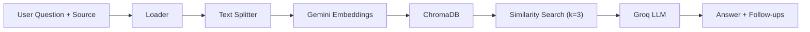

<p align="center">
  
</p>

<h1 align="center">OmniQuery</h1>

<p align="center">
  <strong>AI-Powered Multi-Source Question Answering Platform</strong>
</p>

<p align="center">
  Ask questions about any website, YouTube video, or document — and get instant, context-grounded answers powered by RAG.
</p>

<p align="center">
  <a href="#features">Features</a> •
  <a href="#architecture">Architecture</a> •
  <a href="#tech-stack">Tech Stack</a> •
  <a href="#getting-started">Getting Started</a> •
  <a href="#api-reference">API Reference</a> •
  <a href="#project-structure">Project Structure</a> •
  <a href="#contributing">Contributing</a> •
  <a href="#license">License</a>
</p>

<br />

---

## Overview

**OmniQuery** is a full-stack Retrieval-Augmented Generation (RAG) application that lets users query information from three distinct source types through a single, elegant chat interface:

| Source | What it does |
|--------|-------------|
| 🌐 **Web Pages** | Scrapes and indexes any public URL, then answers questions grounded in the page content |
| 🎬 **YouTube Videos** | Extracts video transcripts, chunks and embeds them, then answers questions about the video |
| 📄 **Documents** | Accepts PDF, DOCX, PPTX, XLSX, CSV, TXT, JSON, Markdown, and HTML uploads for Q&A |

Each pipeline follows the same pattern: **Ingest → Chunk → Embed → Store → Retrieve → Generate** — ensuring accurate, hallucination-resistant answers backed by source material.

---

## Features

- **🧠 RAG Pipeline** — Retrieval-Augmented Generation with ChromaDB vector storage and Google Gemini embeddings
- **⚡ Groq-Powered LLM** — Lightning-fast inference using `openai/gpt-oss-20b` via the Groq API
- **📎 Multi-Format Document Support** — PDF, DOCX, PPTX, XLSX, CSV, TXT, JSON, Markdown, HTML
- **🎥 YouTube Transcript Analysis** — Automatic transcript extraction and per-video vector collections
- **🌍 Website Q&A** — Scrape any public URL and ask questions about its content
- **💬 Modern Chat UI** — Polished, animated chat interface with source badges, file uploads, and thinking indicators
- **🎭 Cinematic Intro** — Arc-reveal preloader that cycles through supported source types
- **🔗 Unified API Proxy** — Next.js API route proxies all requests to the FastAPI backend, eliminating CORS concerns
- **📝 Follow-Up Questions** — Every answer includes 2–3 context-grounded follow-up suggestions

---

## Architecture

OmniQuery uses a **decoupled client-server architecture** with a Next.js frontend and a Python FastAPI backend.

```
┌─────────────────────────────────────────────────────────────┐
│                       CLIENT (Next.js)                      │
│                                                             │
│   page.tsx ──► ChatInterface ──► ClaudeChatInput            │
│                     │                                       │
│              POST /api/query                                │
│                     │                                       │
│          route.ts (API Proxy)                               │
└─────────────┬───────────────────────────────────────────────┘
              │  HTTP (JSON / FormData)
              ▼
┌─────────────────────────────────────────────────────────────┐
│                    SERVER (FastAPI + Python)                 │
│                                                             │
│   app.py ──► /api/query/web      ──► web_pipeline()         │
│          ──► /api/query/youtube  ──► youtube_pipeline()      │
│          ──► /api/query/document ──► doc_pipeline()          │
│                     │                                       │
│          ┌──────────┴──────────┐                            │
│          ▼                     ▼                            │
│   ┌─────────────┐     ┌──────────────┐                     │
│   │  ChromaDB   │     │   Groq LLM   │                     │
│   │  (Vectors)  │     │  (Inference)  │                     │
│   └─────────────┘     └──────────────┘                     │
└─────────────────────────────────────────────────────────────┘
```

### Pipeline Flow (per source)



---

## Tech Stack

### Frontend
| Technology | Purpose |
|-----------|---------|
| [Next.js 16](https://nextjs.org/) | React framework with App Router & API routes |
| [React 19](https://react.dev/) | UI library |
| [TypeScript](https://www.typescriptlang.org/) | Type safety |
| [Tailwind CSS 4](https://tailwindcss.com/) | Utility-first styling |
| [Motion (Framer Motion)](https://motion.dev/) | Animations & transitions |
| [shadcn/ui](https://ui.shadcn.com/) | Component primitives |
| [Lucide React](https://lucide.dev/) | Icon system |

### Backend
| Technology | Purpose |
|-----------|---------|
| [FastAPI](https://fastapi.tiangolo.com/) | Async Python web framework |
| [LangChain](https://www.langchain.com/) | RAG orchestration (loaders, splitters, chains) |
| [ChromaDB](https://www.trychroma.com/) | Vector database for embeddings |
| [Google Gemini Embeddings](https://ai.google.dev/) | `gemini-embedding-001` for text embedding |
| [Groq](https://groq.com/) | Ultra-fast LLM inference (`openai/gpt-oss-20b`) |
| [Uvicorn](https://www.uvicorn.org/) | ASGI server |

---

## Getting Started

### Prerequisites

- **Node.js** ≥ 18
- **Python** ≥ 3.10
- **npm** (comes with Node.js)
- API keys for:
  - [Google AI (Gemini)](https://aistudio.google.com/apikey) — for embeddings
  - [Groq](https://console.groq.com/keys) — for LLM inference

### 1. Clone the Repository

```bash
git clone https://github.com/0xJoy07/OmniQuery.git
cd OmniQuery
```

### 2. Backend Setup

```bash
# Navigate to the Python server
cd server/python

# Create and activate a virtual environment
python -m venv .venv

# Windows
.venv\Scripts\activate
# macOS / Linux
source .venv/bin/activate

# Install dependencies
pip install -r requirements.txt
```

Create a `.env` file in `server/python/`:

```env
GOOGLE_API_KEY=your_google_api_key_here
GROQ_API_KEY=your_groq_api_key_here
```

Start the backend server:

```bash
python app.py
# or
uvicorn app:app --host 0.0.0.0 --port 8000 --reload
```

The API will be available at `http://localhost:8000`. Verify with:

```bash
curl http://localhost:8000/api/health
# → {"status": "ok"}
```

### 3. Frontend Setup

```bash
# From the project root
cd client

# Install dependencies
npm install

# Start the development server
npm run dev
```

The app will be available at `http://localhost:3000`.

> **Note:** The Next.js API route at `/api/query` automatically proxies requests to the FastAPI backend at `http://localhost:8000`. To change the backend URL, set the `FASTAPI_BASE_URL` environment variable in the client.

---

## API Reference

### Health Check

```
GET /api/health
```

**Response:**
```json
{ "status": "ok" }
```

---

### Query Web Page

```
POST /api/query/web
Content-Type: application/json
```

**Request Body:**
```json
{
  "url": "https://example.com",
  "question": "What is this page about?"
}
```

**Response:**
```json
{
  "answer": "This page is about...",
  "source": "web"
}
```

---

### Query YouTube Video

```
POST /api/query/youtube
Content-Type: application/json
```

**Request Body:**
```json
{
  "url": "https://www.youtube.com/watch?v=VIDEO_ID",
  "question": "What does the speaker say about AI?"
}
```

**Response:**
```json
{
  "answer": "The speaker discusses...",
  "source": "youtube"
}
```

---

### Query Document

```
POST /api/query/document
Content-Type: multipart/form-data
```

**Form Fields:**
| Field | Type | Description |
|-------|------|-------------|
| `file` | File | Document to query (max 50 MB) |
| `question` | String | Question about the document |

**Supported formats:** `.pdf`, `.doc`, `.docx`, `.ppt`, `.pptx`, `.xls`, `.xlsx`, `.csv`, `.txt`, `.log`, `.json`, `.md`, `.html`, `.htm`

**Response:**
```json
{
  "answer": "According to the document...",
  "source": "document"
}
```

---

## Project Structure

```
OmniQuery/
├── architechture/                  # Architecture diagrams (Mermaid)
│   ├── doc.architecture.md         # Document pipeline diagram
│   ├── web.architecture.md         # Web pipeline diagram
│   └── yt.architecture.md          # YouTube pipeline diagram
│
├── client/                         # Next.js frontend
│   ├── src/
│   │   ├── app/
│   │   │   ├── api/query/route.ts  # API proxy to FastAPI backend
│   │   │   ├── globals.css         # Global styles & theme variables
│   │   │   ├── layout.tsx          # Root layout (Geist font, dark mode)
│   │   │   └── page.tsx            # Main page (Hero + Chat)
│   │   ├── components/
│   │   │   ├── chat-interface.tsx   # Chat logic & message rendering
│   │   │   └── ui/
│   │   │       ├── arc-preloader-hero.tsx      # Animated intro sequence
│   │   │       ├── claude-style-chat-input.tsx # Rich input with file upload
│   │   │       ├── thinking-tool.tsx           # Loading/thinking indicator
│   │   │       └── button.tsx                  # Button component
│   │   └── lib/
│   │       └── utils.ts            # Utility functions (cn, etc.)
│   ├── package.json
│   ├── next.config.ts
│   └── tsconfig.json
│
├── server/                         # Python backend
│   ├── python/
│   │   ├── app.py                  # FastAPI application & endpoints
│   │   ├── main.py                 # CLI entry point (for testing)
│   │   ├── requirements.txt        # Python dependencies
│   │   └── feature/                # RAG pipeline modules
│   │       ├── __init__.py         # Public API exports
│   │       ├── web/                # Web scraping pipeline
│   │       │   ├── webLoader.py    # URL content scraper
│   │       │   ├── chuncking.py    # Text splitter
│   │       │   ├── embed.py        # Gemini embedding model
│   │       │   ├── chromaDB.py     # Vector store operations
│   │       │   ├── response_generator.py  # Groq LLM response
│   │       │   └── web_main.py     # Pipeline orchestrator
│   │       ├── vid/                # YouTube pipeline
│   │       │   ├── yt_loader.py    # Transcript extractor
│   │       │   ├── chunking.py     # Text splitter
│   │       │   ├── embed.py        # Gemini embedding model
│   │       │   ├── chromaDB.py     # Vector store (per-video collections)
│   │       │   ├── response_generator.py  # Groq LLM response
│   │       │   └── yt_main.py      # Pipeline orchestrator
│   │       └── doc/                # Document pipeline
│   │           ├── doc_loader.py   # Multi-format document loader
│   │           ├── chunking.py     # Text splitter
│   │           ├── embed.py        # Gemini embedding model
│   │           ├── chromaDB.py     # Vector store operations
│   │           ├── response_generator.py  # Groq LLM response
│   │           └── doc_main.py     # Pipeline orchestrator
│   └── fastapi/                    # (Reserved for future use)
│
├── .gitignore
└── README.md                       # ← You are here
```

---

## Environment Variables

| Variable | Where | Required | Description |
|----------|-------|----------|-------------|
| `GOOGLE_API_KEY` | `server/python/.env` | ✅ | Google AI API key for Gemini embeddings |
| `GROQ_API_KEY` | `server/python/.env` | ✅ | Groq API key for LLM inference |
| `CORS_ORIGINS` | `server/python/.env` | ❌ | Comma-separated allowed origins (default: `http://localhost:3000`) |
| `FASTAPI_BASE_URL` | `client/.env.local` | ❌ | Backend URL (default: `http://localhost:8000`) |

---

## Usage

1. **Start both servers** (backend on `:8000`, frontend on `:3000`)
2. **Open** `http://localhost:3000` in your browser
3. **Watch** the cinematic intro cycle through supported source types
4. **Select a source** in the chat input (Web, YouTube, or Document)
5. **Provide context** — paste a URL or upload a document
6. **Ask your question** and receive a grounded answer with follow-up suggestions

---

## Contributing

Contributions are welcome! Here's how to get started:

1. **Fork** the repository
2. **Create a feature branch** (`git checkout -b feature/amazing-feature`)
3. **Commit your changes** (`git commit -m 'Add amazing feature'`)
4. **Push to the branch** (`git push origin feature/amazing-feature`)
5. **Open a Pull Request**

---

## Contributors

<table>
  <tr>
    <td align="center"><strong>Joy Sengupta</strong></td>
    <td align="center"><strong>Anushikha Kundu</strong></td>
    <td align="center"><strong>Srijan Mandal</strong></td>
  </tr>
</table>

---

## License

This project is part of an industrial training initiative under **Euphoria GenX**. Please check with the project maintainers for licensing details.
