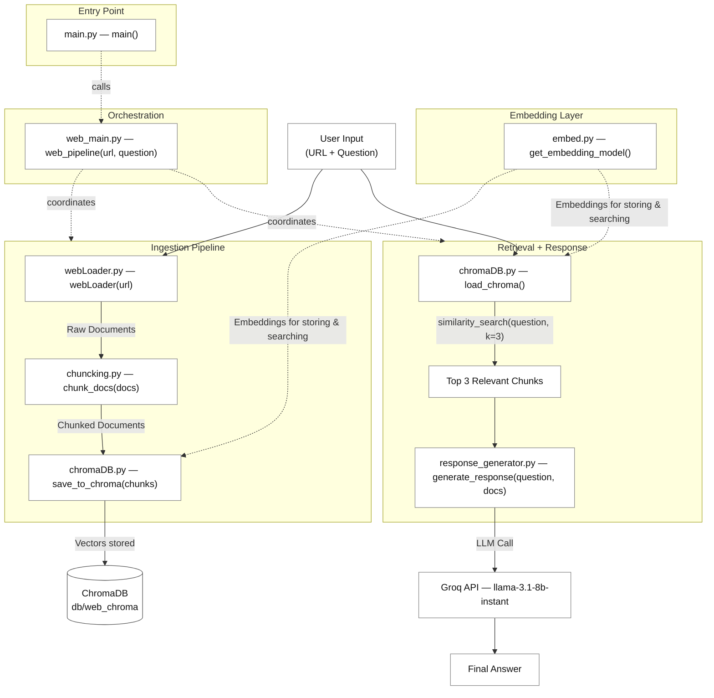

```mermaid
flowchart TD
    A["User Input\n(URL + Question)"] --> B

    subgraph INGESTION["Ingestion Pipeline"]
        B["webLoader.py — webLoader(url)"]
        B -->|Raw Documents| C["chuncking.py — chunk_docs(docs)"]
        C -->|Chunked Documents| D["chromaDB.py — save_to_chroma(chunks)"]
    end

    subgraph EMBEDDING["Embedding Layer"]
        E["embed.py — get_embedding_model()"]
    end

    D -->|Vectors stored| F[("ChromaDB\ndb/web_chroma")]
    A --> G

    subgraph RETRIEVAL["Retrieval + Response"]
        G["chromaDB.py — load_chroma()"]
        G -->|"similarity_search(question, k=3)"| H["Top 3 Relevant Chunks"]
        H --> I["response_generator.py — generate_response(question, docs)"]
    end

    E -.->|Embeddings for storing & searching| D
    E -.->|Embeddings for storing & searching| G
    I -->|LLM Call| J["Groq API — llama-3.1-8b-instant"]
    J --> K["Final Answer"]

    subgraph ORCHESTRATOR["Orchestration"]
        L["web_main.py — web_pipeline(url, question)"]
    end

    L -.->|coordinates| INGESTION
    L -.->|coordinates| RETRIEVAL

    subgraph ENTRY["Entry Point"]
        M["main.py — main()"]
    end

    M -.->|calls| L

    classDef default fill:#ffffff,stroke:#888,stroke-width:1px,color:#111
    %% classDef io fill:#eeeeee,stroke:#333,stroke-width:1.5px,color:#111,font-weight:bold
    classDef store fill:#ffffff,stroke:#555,stroke-width:1px,color:#111

    class A,K io
    class F store
```