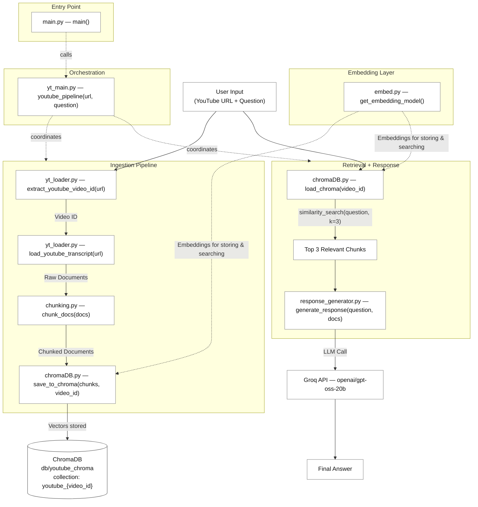

```mermaid
flowchart TD
    A["User Input\n(YouTube URL + Question)"] --> B

    subgraph INGESTION["Ingestion Pipeline"]
        B["yt_loader.py — extract_youtube_video_id(url)"]
        B -->|Video ID| B2["yt_loader.py — load_youtube_transcript(url)"]
        B2 -->|Raw Documents| C["chunking.py — chunk_docs(docs)"]
        C -->|Chunked Documents| D["chromaDB.py — save_to_chroma(chunks, video_id)"]
    end

    subgraph EMBEDDING["Embedding Layer"]
        E["embed.py — get_embedding_model()"]
    end

    D -->|Vectors stored| F[("ChromaDB\ndb/youtube_chroma\ncollection: youtube_{video_id}")]
    A --> G

    subgraph RETRIEVAL["Retrieval + Response"]
        G["chromaDB.py — load_chroma(video_id)"]
        G -->|"similarity_search(question, k=3)"| H["Top 3 Relevant Chunks"]
        H --> I["response_generator.py — generate_response(question, docs)"]
    end

    E -.->|Embeddings for storing & searching| D
    E -.->|Embeddings for storing & searching| G
    I -->|LLM Call| J["Groq API — openai/gpt-oss-20b"]
    J --> K["Final Answer"]

    subgraph ORCHESTRATOR["Orchestration"]
        L["yt_main.py — youtube_pipeline(url, question)"]
    end

    L -.->|coordinates| INGESTION
    L -.->|coordinates| RETRIEVAL

    subgraph ENTRY["Entry Point"]
        M["main.py — main()"]
    end

    M -.->|calls| L

    classDef default fill:#ffffff,stroke:#888,stroke-width:1px,color:#111
    %% classDef io fill:#eeeeee,stroke:#333,stroke-width:1.5px,color:#111,font-weight:bold
    classDef store fill:#ffffff,stroke:#555,stroke-width:1px,color:#111

    class A,K io
    class F store
```
